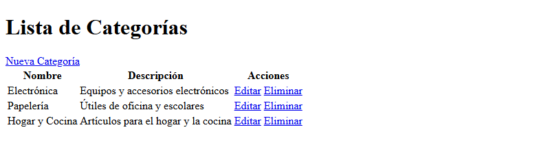
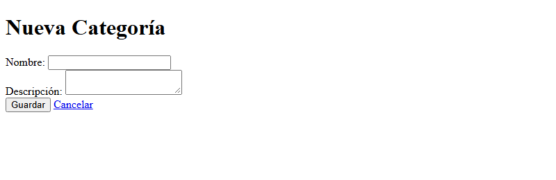
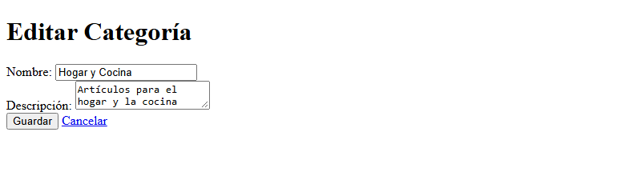
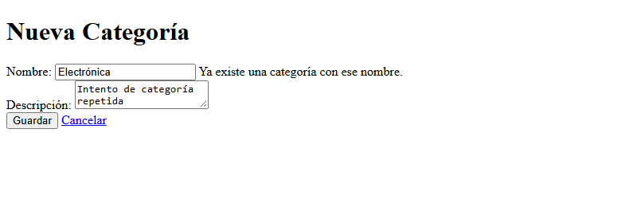
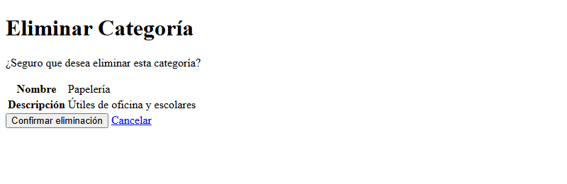
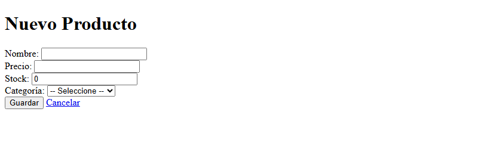
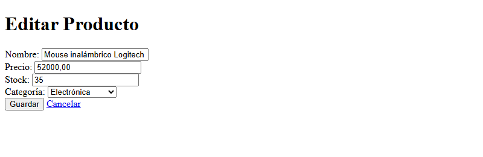
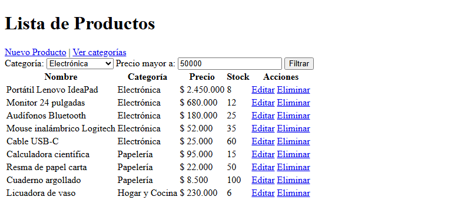
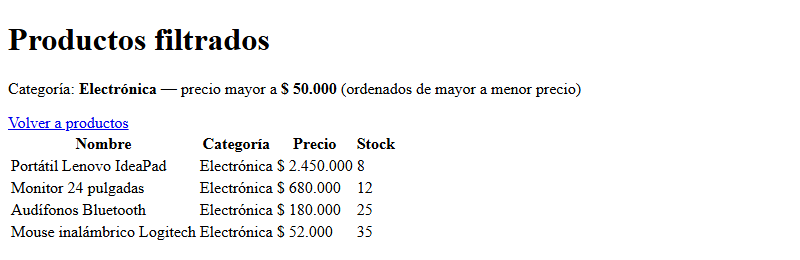
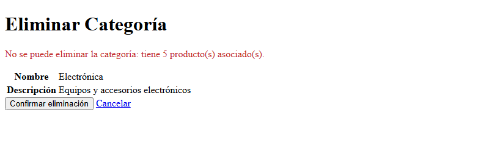

# Post-contenido — Unidad 8: Persistencia con JPA/Hibernate

## Descripción
Repositorio del laboratorio de la Unidad 8 de Programación Web —
Séptimo Semestre. Contiene un único proyecto Maven Spring Boot
(catalogo-jpa/) con un CRUD de categorías usando Spring Data JPA e
Hibernate contra MySQL, y su extensión con la entidad Producto y una
relación @ManyToOne/@OneToMany hacia Categoria.

**Tecnologías:** Java 17, Spring Boot 3.2.12 (Spring Web, Spring Data JPA, Thymeleaf, Validation),
Hibernate 6.4, MySQL 8 (driver mysql-connector-j).

## Funcionalidades implementadas
- **Categorías:** listar, crear, editar y eliminar (con página de confirmación).
- Validación de categoría con Bean Validation (`@NotBlank`, `@Size`) y nombre único,
  con el mensaje "Ya existe una categoría con ese nombre." junto al campo.
- **Productos:** listar (con el nombre de su categoría), crear, editar y eliminar.
- Validación de producto (`@NotBlank`, `@NotNull`, `@Positive`, `@Min`) y categoría obligatoria.
- Relación bidireccional Producto → Categoria (`@ManyToOne` LAZY) y Categoria → Producto (`@OneToMany` mappedBy).
- Consulta JPQL personalizada con `@Query` y `JOIN FETCH`: productos de una categoría con
  precio mayor a un valor, en una sola sentencia SQL y ordenados de mayor a menor precio.
- Rechazo de la eliminación de una categoría que tiene productos asociados.

## Estructura del proyecto
```
cardenas-post1-u8/
├── README.md
├── capturas/
└── catalogo-jpa/
    ├── pom.xml
    ├── mvnw, mvnw.cmd, .mvn/
    └── src/main/
        ├── java/com/universidad/catalogo/
        │   ├── CatalogoApplication.java
        │   ├── model/
        │   │   ├── Categoria.java            ← lado inverso (@OneToMany mappedBy)
        │   │   └── Producto.java             ← lado propietario (@ManyToOne + @JoinColumn)
        │   ├── repository/
        │   │   ├── CategoriaRepository.java
        │   │   └── ProductoRepository.java   ← consultas JPQL con JOIN FETCH
        │   ├── service/
        │   │   ├── CategoriaService.java
        │   │   └── ProductoService.java
        │   └── controller/
        │       ├── CategoriaController.java
        │       └── ProductoController.java
        └── resources/
            ├── application.properties
            └── templates/
                ├── categorias/ (lista, formulario, confirmar-eliminar)
                └── productos/  (lista, formulario, filtrados)
```

## Parte 1 — CRUD de Categoría con JPA/Hibernate y MySQL
CategoriaController, CategoriaService y CategoriaRepository
(JpaRepository) gestionan la entidad Categoria, persistida en MySQL
mediante Hibernate. Listado, registro, edición y eliminación con
validación de campos (@NotBlank, nombre único) y plantillas Thymeleaf
(lista.html, formulario.html, confirmar-eliminar.html).

| Método | Ruta | Descripción |
|---|---|---|
| GET | `/categorias` | Lista de categorías |
| GET | `/categorias/nuevo` | Formulario de nueva categoría |
| GET | `/categorias/editar/{id}` | Formulario de edición prellenado |
| POST | `/categorias/guardar` | Crea o actualiza (valida campos y nombre único) |
| GET | `/categorias/eliminar/{id}` | Página de confirmación |
| POST | `/categorias/eliminar/{id}` | Elimina (se rechaza si tiene productos) |

## Parte 2 — Relación @ManyToOne/@OneToMany con Producto
La entidad Producto agrega la relación @ManyToOne hacia Categoria
(columna categoria_id, FetchType.LAZY explícito), con el lado inverso
@OneToMany en Categoria. ProductoRepository expone
buscarPorCategoriaConPrecioMayorA, una consulta JPQL personalizada con
@Query y JOIN FETCH que retorna los productos de una categoría con
precio mayor a un valor dado en una sola sentencia SQL.

### Diagrama de la relación Categoria – Producto
```
┌────────────────────────────────┐          ┌────────────────────────────────┐
│           categorias           │          │           productos            │
├────────────────────────────────┤          ├────────────────────────────────┤
│ PK id           BIGINT         │ 1      N │ PK id           BIGINT         │
│    nombre       VARCHAR(80)    │◄─────────┤ FK categoria_id BIGINT NOT NULL│
│                 UNIQUE NOT NULL│          │    nombre       VARCHAR(120)   │
│    descripcion  VARCHAR(250)   │          │    precio       DECIMAL(10,2)  │
└────────────────────────────────┘          │    stock        INT            │
                                            └────────────────────────────────┘

Categoria                                    Producto
  @OneToMany(mappedBy = "categoria",           @ManyToOne(fetch = LAZY)
             fetch = LAZY)                     @JoinColumn(name = "categoria_id",
  List<Producto> productos   ◄── inverso         nullable = false)
                                               Categoria categoria   ◄── propietario
```
- Una **Categoria** agrupa muchos **Producto**; cada Producto pertenece a exactamente una Categoria.
- **Producto** es el dueño de la relación: guarda la clave foránea `categoria_id`.
- **Categoria.productos** es el lado inverso (`mappedBy`): no tiene `@JoinColumn` ni cascade.
- `Producto.asignarCategoria(...)` es el método helper que mantiene sincronizados ambos lados.

### Consulta JPQL personalizada
```java
@Query("SELECT p FROM Producto p JOIN FETCH p.categoria c " +
       "WHERE c.id = :categoriaId AND p.precio > :precioMinimo " +
       "ORDER BY p.precio DESC")
List<Producto> buscarPorCategoriaConPrecioMayorA(Long categoriaId, BigDecimal precioMinimo);
```
SQL generado por Hibernate (una sola sentencia, sin consultas N+1):
```sql
select p1_0.id, p1_0.categoria_id, c1_0.id, c1_0.descripcion, c1_0.nombre,
       p1_0.nombre, p1_0.precio, p1_0.stock
from productos p1_0
join categorias c1_0 on c1_0.id = p1_0.categoria_id
where p1_0.categoria_id = ? and p1_0.precio > ?
order by p1_0.precio desc
```

| Método | Ruta | Descripción |
|---|---|---|
| GET | `/productos` | Lista de productos con su categoría (`findAllConCategoria`, JOIN FETCH) |
| GET | `/productos/nuevo` | Formulario de nuevo producto |
| GET | `/productos/editar/{id}` | Formulario de edición prellenado |
| POST | `/productos/guardar` | Crea o actualiza (valida campos y categoría) |
| POST | `/productos/eliminar/{id}` | Elimina el producto (formulario POST con confirmación) |
| GET | `/productos/categoria/{id}/precio-mayor?minimo=50000` | Consulta JPQL filtrada por categoría y precio |

## Configuración de la base de datos
1. Tener MySQL 8 en ejecución. Con Docker:
   `docker run -d --name mysql-catalogo -p 3306:3306 -e MYSQL_ROOT_PASSWORD=root mysql:8`
2. Crear la base de datos y el usuario en MySQL (`mysql -u root -p`):
   ```sql
   CREATE DATABASE catalogo_db CHARACTER SET utf8mb4 COLLATE utf8mb4_unicode_ci;
   CREATE USER "appuser"@"localhost" IDENTIFIED BY "apppass";
   GRANT ALL PRIVILEGES ON catalogo_db.* TO "appuser"@"localhost";
   FLUSH PRIVILEGES;
   ```
   Si MySQL corre en Docker, la conexión desde la aplicación no llega como
   `localhost` sino desde la red de Docker, por lo que también se crea el usuario para cualquier host:
   ```sql
   CREATE USER "appuser"@"%" IDENTIFIED BY "apppass";
   GRANT ALL PRIVILEGES ON catalogo_db.* TO "appuser"@"%";
   FLUSH PRIVILEGES;
   ```
3. Configurar `catalogo-jpa/src/main/resources/application.properties`
   con la URL, usuario y contraseña de MySQL:
   ```properties
   spring.datasource.url=jdbc:mysql://localhost:3306/catalogo_db?useSSL=false&allowPublicKeyRetrieval=true&serverTimezone=UTC
   spring.datasource.username=${DB_USERNAME:appuser}
   spring.datasource.password=${DB_PASSWORD:apppass}
   spring.jpa.hibernate.ddl-auto=update
   spring.jpa.show-sql=true
   ```
   Las credenciales se leen de las variables de entorno `DB_USERNAME` y `DB_PASSWORD`;
   si no están definidas se usan `appuser` / `apppass`, por lo que no hace falta configurar nada
   para el laboratorio. Las tablas `categorias` y `productos` las crea Hibernate automáticamente al arrancar.

## Decisiones de diseño
- ddl-auto=update en lugar de create: conserva los datos de prueba
  entre reinicios mientras se agregaban las entidades de ambas partes
  (al agregar Producto, Hibernate creó la tabla productos sin borrar las categorías).
- Nombre único en Categoria: se valida en CategoriaService antes de
  guardar, con mensaje de error legible en el formulario (el controlador
  convierte la excepción del servicio en un error del campo nombre), y se
  refuerza con `unique = true` en la columna.
- FetchType.LAZY explícito en Producto.categoria: @ManyToOne es EAGER por
  defecto; LAZY evita cargar la categoría en cada acceso a un producto. Las
  vistas que sí necesitan el nombre de la categoría usan JOIN FETCH
  explícito en el repositorio (findAllConCategoria y la consulta filtrada),
  así se evita el problema N+1.
- Sin cascade = REMOVE de Categoria hacia Producto: eliminar una
  categoría con productos asociados se rechaza explícitamente en el
  servicio ("No se puede eliminar la categoría: tiene N producto(s)
  asociado(s).") en lugar de borrar productos en cascada.
- Método helper `asignarCategoria` en Producto (lado propietario): asigna
  la categoría y mantiene sincronizada la lista `productos` del lado
  inverso, para que ambos lados de la relación en memoria sean consistentes.
- Credenciales de la base de datos por variables de entorno
  (`${DB_PASSWORD:apppass}`) en lugar de escribir la contraseña directamente
  en application.properties, como recomienda el análisis de SonarCloud.
- Eliminar productos con un formulario POST (no un enlace GET): una petición
  GET no debe modificar datos del servidor.
- Plantillas accesibles: `lang="es"` en cada página y cada `<label>` asociado
  a su campo con `for`/`id`.
- `allowPublicKeyRetrieval=true` en la URL de conexión: MySQL 8 usa
  `caching_sha2_password` y, con `useSSL=false`, el driver no puede
  autenticarse sin pedir la clave pública del servidor.

## Cómo compilar y ejecutar
1. Clonar el repositorio: `git clone https://github.com/Moisex006/cardenas-post1-u8.git`
2. Crear la base de datos catalogo_db en MySQL (ver arriba)
3. Configurar catalogo-jpa/src/main/resources/application.properties
   con las credenciales de MySQL
4. Ejecutar `./mvnw spring-boot:run` dentro de catalogo-jpa/
5. Parte 1: acceder a http://localhost:8080/categorias
   Parte 2: acceder a http://localhost:8080/productos

## Capturas de pantalla

### Parte 1 — CRUD de categorías
Lista de categorías:



Crear categoría:



Editar categoría (formulario prellenado):



Nombre duplicado rechazado:



Confirmar eliminación:



### Parte 2 — Productos y relación con categoría
Formulario de producto:



Editar producto:



Lista de productos con el nombre de su categoría (JOIN FETCH):



Consulta JPQL: productos de Electrónica con precio mayor a $50.000, de mayor a menor:



Intento de eliminar una categoría con productos asociados:


